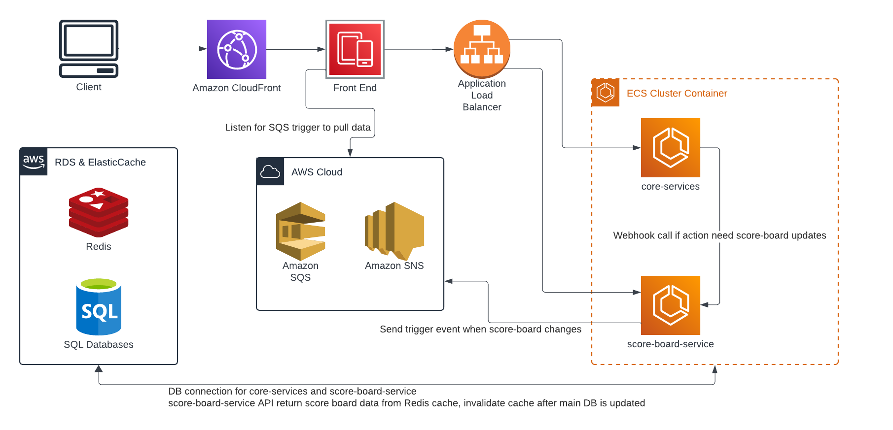

## Realtime Score Board Module

### Overview

The Scoreboard module is responsible for managing the scoreboard functionality within the application. It handles updating user scores, real-time scoreboard updates, and ensuring data integrity and security.

### Features

- Real-time scoreboard updates upon user actions.
- Authorization to prevent unauthorized score changes.
- Integration with caching mechanism for improved performance.
- Audit Log (Enhancement).

### Solution Diagram

### Proposed Backend Stack

- NestJS (TypeScript)
- PostgreSQL
- Swagger (OpenAPI integration with NestJS)
- AWS (RDS/ECS/ALB/CF/SNS/SQS/ElasticCache/S3...)

### Proposed API Endpoints

- POST /action `(core-service)`

  - Implementation:
    - For front-end to call, trigger for user's action.
    - Authorize using JWT.
    - Implement logic to handle user's action and calculate score.
    - Call `score-board-service` POST /score to update user's score.
  - Request Body: `{ userId: string, action: string, ... }`
  - Response: 200 OK on success, 401 Unauthorized if action is unauthorized.

- POST /scores `(score-board-service)`

  - Implementation:
    - Only for the internal `core-service` to call and update user scores based on user actions.
    - Authorize using internal access token.
    - Update score of user by summing the requested `score`.
    - Invalidate the Redis cache.
  - Request Body: `{ userId: string, action: string, score: number }`
  - Response: 200 OK on success, 401 Unauthorized if action is unauthorized.

- GET /scores `(score-board-service)`

  - Implementation:
    - For front-end to call.
    - Authorize using the same JWT with the core-service.
    - Query the Redis cache first.
    - Return the top 10 user scores.
  - Response: 200 OK with scoreboard data.

### Enhancement

- Implement Audit Log on each `POST /scores` for better monitoring and debugging of the application.
- Consider implementing rate limiting to prevent abuse of the scoring endpoint.